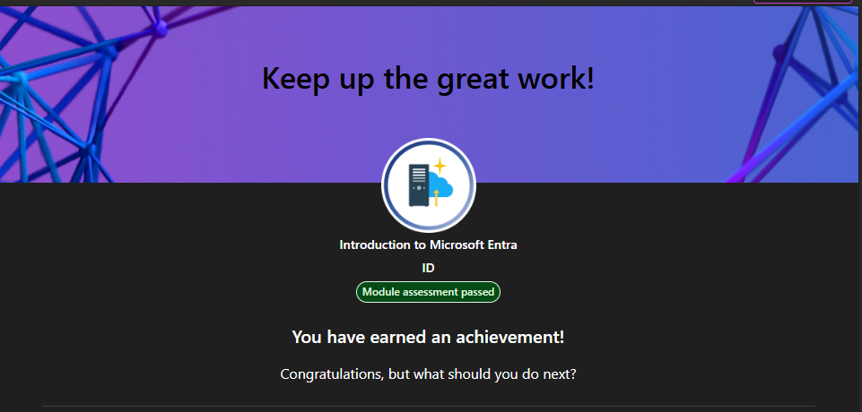

# Module — Introduction to Microsoft Entra ID

## 🎯 What I learned
- What Microsoft Entra ID is and where it fits in the Microsoft Cloud.
- Difference between identities, accounts, and directory objects.
- Core objects: users, groups, devices, roles, and applications.
- How Entra ID provides authentication and authorization for Microsoft 365 and Azure.
- Basic Zero Trust ideas related to identity.

## 🧠 Key takeaways
- Entra ID = the identity backbone for Microsoft cloud services.
- Every access decision starts with an identity + authentication.
- Groups and roles simplify permissions and access control.
- Devices and applications are also identities inside Entra ID.

## ✔ Status
**Completed on:** 07/12/2025
